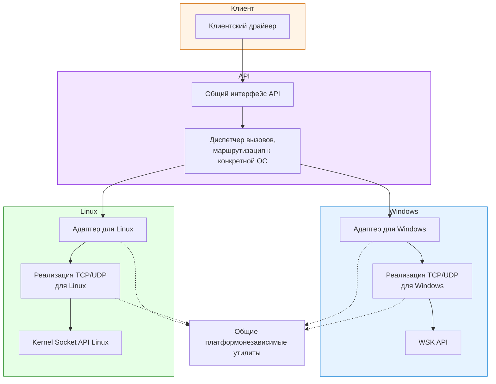

# Архитектура KernelSocket API

## Общая концепция

KernelSocket — это **абстрактный слой** между клиентским драйвером и нативными сетевыми интерфейсами ОС. Клиентский драйвер работает с единым API, не задумываясь о том, под какой операционной системой он выполняется.

---

## Ключевые модули

### 1. Клиентский драйвер

Любой ядерный драйвер, которому нужна сетевая функциональность.

**Задачи:**
- Решает свою прикладную задачу (мониторинг, логирование, взаимодействие с удалёнными серверами)
- Вызывает функции API, не задумываясь о платформе
- Получает результаты в едином, понятном формате

> **Важно:** Клиентский драйвер ничего не знает о внутреннем устройстве библиотеки. Для него API — это просто набор функций, которые работают одинаково на всех платформах.

---

### 2. Общий интерфейс API

Набор объявлений (контракт), определяющий взаимодействие клиентских драйверов с библиотекой.

**Задачи:**
- Определяет единые типы данных (адреса, сокеты, коды ошибок)
- Объявляет все доступные функции для работы с TCP и UDP
- Задаёт единые правила и соглашения для всех платформ

> **Важно:** Это единственное, что видит клиентский драйвер. Внутреннее устройство библиотеки для него скрыто.

---

### 3. Диспетчер вызовов (маршрутизация к конкретной ОС)

Внутренний механизм, который принимает вызовы от клиента и направляет их к нужной реализации.

**Задачи:**
- Определяет, под какой ОС мы работаем
- Направляет вызовы к соответствующему адаптеру (Windows или Linux)
- Выполняет общие проверки и валидацию, единые для всех платформ

> **Важно:** Диспетчер — это "стрелочник". Он не знает деталей работы с сетью, он просто передаёт управление тому, кто эти детали знает.

---

### 4. Общие платформонезависимые утилиты

Набор вспомогательных механизмов, которые используют все остальные слои.

**Задачи:**
- Отделить общий платформонезависимый код, используемый обеими протоколами на обеих платформах
- Исключить повторяющийся код в реализации сетевых протоколов

> **Важно:** Утилиты — это общий инструментарий. Все слои библиотеки, которые находятся после диспетчера вызовов пользуются ими, но сами утилиты не зависят от других слоёв.

---

### 5. Адаптеры для Windows и Linux

Два параллельных модуля — по одному для каждой платформы. Каждый подготавливает свою платформу к работе с сетью.

**Задачи:**
- Отделить платформозависимый код, используемый в реализации обоих протоколов

> **Важно:** Адаптеры готовят почву для работы, но сами сетевые операции пока не выполняют. Это уровень подготовки и определения внутренних структур и общих платформозависимых функций.

---

### 6. Реализация UDP и TCP протоколов

Конкретный код, который выполняет реальные сетевые операции для каждой ОС.

**Задачи:**
- Реализовать корректную работу TCP и UDP протоколов для конкретной платформы

> **Важно:** Это самый нижний слой библиотеки. Здесь происходит реальная трансляция универсальных вызовов в системные вызовы конкретной ОС.

---

## Пример взаимодействия (отправка TCP данных на Windows)

Ниже представлен алгоритм работы API на примере отправки данных по протоколу TCP в операционной системе Windows:

1. **Клиентский драйвер** решает отправить данные по сети. Он вызывает функцию "отправить" из единого API.

2. **Единый интерфейс** принимает этот вызов и передаёт его в диспетчер.

3. **Диспетчер** определяет, что мы работаем под Windows, и направляет вызов в Windows-адаптер.

4. **Windows-адаптер** принимает вызов, но для реальной отправки передаёт управление в слой реализации TCP для Windows.

5. **Реализация TCP под Windows** берёт данные клиента, преобразует их в формат, понятный WSK, и вызывает системную функцию Windows для отправки.

6. **Сетевой стек Windows** выполняет реальную отправку данных в сеть.

7. **Результат** проходит обратный путь: от сетевого стека через реализацию TCP, через адаптер, через диспетчер к клиентскому драйверу.

На этапе 4 и 5, могут использоваться общие платформонезависимые утилиты.